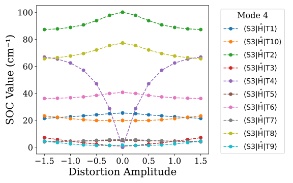

# Automating Gaussian Distortion Study

This repository contains a few codes which will be useful while working with the Gaussical Software while studying the intersystem crossing rates and molecular distortion studies. These scripts help to reduce the manual work and time consumption.

## Scripts Overview

- **kisc.py**
  Calculates the intersystem crossing rate for a transition; it requires the user input of energies and the SOC value.

- **kisc_calc.py**
  This script needs the paths for the log files of singlet and triplet energies, and the path for the soc_out.dat file. It gives the output file containing the intersystem crossing rates for all transitions.

- **calc.py**
  This script automates the full sequential calculations from - 
  - Optimization + Frequency(Opt+Freq)
  - Energy Calculations(singlet & triplet)
  - PySOC calculations for SOC
    It requires the path for the first input .com file and the path of the init.py file of PySOC.

- **distort.py**
  It automates the process of studying how the SOC value changes with the change in geometry of the normal modes of the molecule. You can specify how many modes you want to study by specifying it in the code at the end in the main block. Additionally, in this script, you can mention the level of theory, basis set, cores to use, and memory in the main block, and it will use the same values for all calculations. It gives the output plots like the following

  

- **rm_gaus.py**
  This script is specifically created to delete the checkpoint files and readwrite files of the binary file after running pysoc.py. As these files take a large amount of memory, deleting them after calculating SOC is better. While using, put this file in the same location where distort.py is located.
 
## Requirements
> All these files require Python 3 to run smoothly. 
> For the distortion script, we need a Fortran-based file to distort the normal modes.
